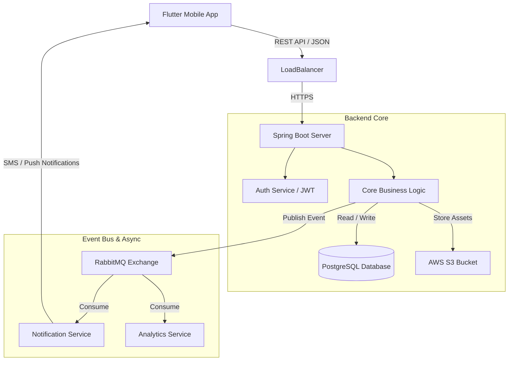

# 🌱 Krishi Mitra – Backend

> **Empowering Indian Farmers through Technology**


---

## 📖 Overview

**Krishi Mitra** is a comprehensive full-stack agricultural ecosystem designed to bridge the gap between farmers and vital resources.  
This repository hosts the **Backend Server**, built with **Spring Boot**, acting as the core engine for:

- Real-time market analysis  
- Resource management  
- Expert consultation  
- Reliable alert delivery  

The backend follows an **Event-Driven Architecture** to handle high-concurrency workloads and ensure reliable delivery of critical alerts (weather, market prices), even in **low-bandwidth rural environments**.

---

## 📱 Mobile Application

The frontend for this project is built using **Flutter**.

👉 **[Krishi Mitra Mobile App Repository](https://github.com/AaryanCode69/Krishi-Mitra-App.git)**

---

## 🏗️ System Architecture

The backend is designed with **scalability**, **fault tolerance**, and **asynchronous processing** in mind, leveraging microservice-inspired patterns.

### 🔁 High-Level Data Flow

1. **Client Layer** – Flutter mobile app sends RESTful HTTP requests  
2. **API Layer** – Spring Boot Controllers handle validation and JWT-based authentication  
3. **Service Layer** – Core business logic (market prices, consultations, analytics)  
4. **Asynchronous Messaging** – RabbitMQ decouples services for alerts & analytics  
5. **Persistence Layer** – PostgreSQL stores structured domain data  
6. **Cloud Storage** – AWS S3 stores static assets (images, reports)

---

### 🧩 Architecture Diagram



---

## 🛠️ Tech Stack

| Category | Technology |
|----------|------------|
| **Language** | Java 17+ |
| **Framework** | Spring Boot 3.x |
| **Build Tool** | Maven |
| **Database** | PostgreSQL |
| **Messaging** | RabbitMQ (AMQP) |
| **Cloud Services** | AWS (S3 for storage) |
| **Security** | Spring Security, JWT (JSON Web Tokens) |
| **API Documentation** | Swagger / OpenAPI 3.0 |

---

## ✨ Key Features

- 🌾 **Marketplace Management**: APIs for farmers to list produce and for buyers to place orders securely.
- ⛅ **Real-time Weather & Advisory**: Integration with external weather APIs to provide localized farming advice.
- 🔔 **Asynchronous Alerts**: RabbitMQ-based notification system for critical updates (pest attacks, weather warnings).
- 🔐 **Secure Authentication**: Role-based access control (Admin, Farmer, Expert) using JWT standards.
- 📉 **Data Analytics**: Endpoints serving aggregated data on crop prices and market trends.

---

---

## 🚀 Getting Started

Follow these instructions to set up the project locally for development.

### Prerequisites

- Java Development Kit (JDK) 17 or higher
- Maven
- PostgreSQL installed locally
- RabbitMQ Server running

### Installation

1. **Clone the repository**

```bash
git clone https://github.com/AaryanCode69/Krishi-Mitra-Backend.git
cd Krishi-Mitra-Backend
```

2. **Configure Environment Variables**

Update `src/main/resources/application.properties`:

```properties
# Database Configuration
spring.datasource.url=jdbc:postgresql://localhost:5432/krishimitra_db
spring.datasource.username=your_db_user
spring.datasource.password=your_db_password
spring.jpa.hibernate.ddl-auto=update

# RabbitMQ Configuration
spring.rabbitmq.host=localhost
spring.rabbitmq.port=5672
spring.rabbitmq.username=guest
spring.rabbitmq.password=guest

# AWS Configuration (Optional for Local)
cloud.aws.credentials.access-key=YOUR_ACCESS_KEY
cloud.aws.credentials.secret-key=YOUR_SECRET_KEY
```

3. **Build the Project**

```bash
mvn clean install
```

4. **Run the Application**

```bash
mvn spring-boot:run
```

The server will start at `http://localhost:8080`.
